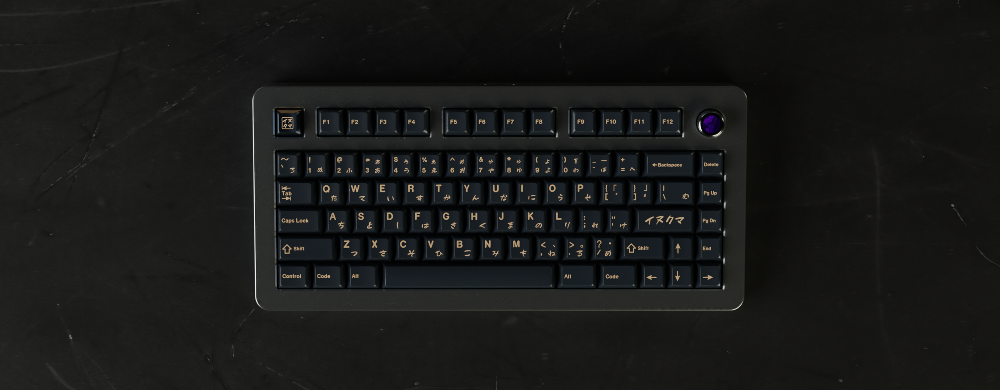

# Overview

### Status: Completed
- Shipping to customers
- Extras currently on sale at some regional vendors.

---

## Description

The **Paragon** is a 75% gasket mount keyboard featuring a rotary encoder. The original design for the Paragon
began in June 2020, when keyboards such as the [Satisfaction75](https://cannonkeys.com/collections/satisfaction-75) and
the [GMMK Pro](https://www.gloriousgaming.com/products/glorious-gmmk-pro-75-barebone-black) were regarded as the most popular
offerings in the hobby.

The Paragon features an engraving of the skyline of San Francisco, with which we pay homage to the heart of the technology and software
industry, Silicon Valley.

## Details

- **Layout:** 75%
- **Mounting Style:** Poron/Silicone Gasket Mount
- **Typing Angle:** 7 degrees
- **Offered Colors:**
  - E-White
  - Black
  - Deep Navy
  - Gunmetal
  - Purple
- **Offered PCB Options:**
  - Hotswap
  - Solder
- **Offered Plate Options:**
  - 1.5mm Aluminum
  - 1.5mm Polycarbonate
- **Groupbuy Period:** January 7-31, 2022
- **Pricing:** $480

More information can be found in the following GeekHack pages:

Interest Check: https://geekhack.org/index.php?topic=107743.0

Groupbuy: https://geekhack.org/index.php?topic=115873.0

