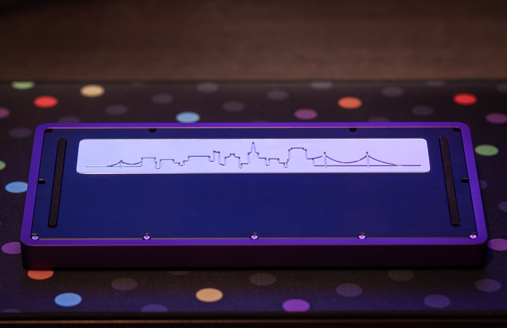

# Overview

### Status: Fulfilling
- Shipping to customers
- Extras are currently on sale at some regional vendors

---

### Description

The **Paragon** is a 75% gasket-mounted keyboard featuring a rotary encoder. Our intent was to design a seamless, substantial, and symmetrical 75% with a rotary encoder. The weight pays homage to our roots with the San Francisco skyline.

### Details

- **Layout:** 75%
- **Mounting Style:** Poron/Silicone Gasket-Mount
- **Typing Angle:** 7 degrees
- **Colors:**
  - E-White
  - Black
  - Deep Navy
  - Gunmetal
  - Purple
- **PCB Options:**
  - Hotswap
  - Solder
- **Plate Options:**
  - 1.5mm Aluminum
  - 1.5mm Polycarbonate
- **Groupbuy Period:** January 7-31, 2022
- **Pricing:** $480

### Build Stream
<iframe width="560" height="315" src="https://www.youtube.com/embed/7KdJ7MEapsE" title="YouTube video player" frameborder="0" allow="accelerometer; autoplay; clipboard-write; encrypted-media; gyroscope; picture-in-picture; web-share" allowfullscreen></iframe>

### Sound Tests
<iframe width="560" height="315" src="https://www.youtube.com/embed/t8IRW6TfL9o" title="YouTube video player" frameborder="0" allow="accelerometer; autoplay; clipboard-write; encrypted-media; gyroscope; picture-in-picture; web-share" allowfullscreen></iframe>

<iframe width="560" height="315" src="https://www.youtube.com/embed/1e53OlAWhAs" title="YouTube video player" frameborder="0" allow="accelerometer; autoplay; clipboard-write; encrypted-media; gyroscope; picture-in-picture; web-share" allowfullscreen></iframe>

### External links

- Read more about the original interest check [here](https://geekhack.org/index.php?topic=107743.0)
- Read more about the groupbuy post [here](https://geekhack.org/index.php?topic=115873.0)

