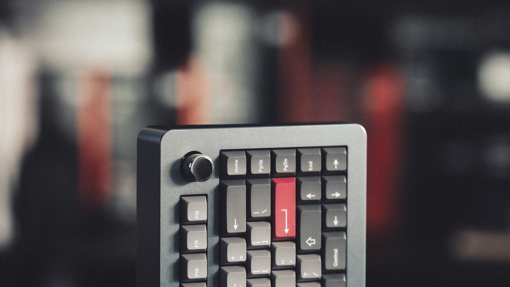
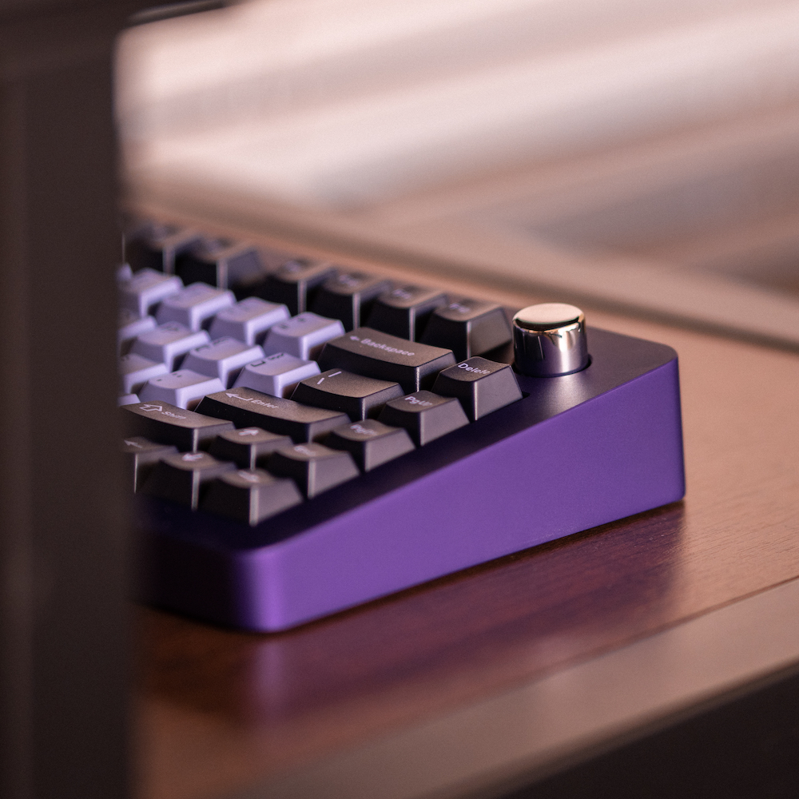
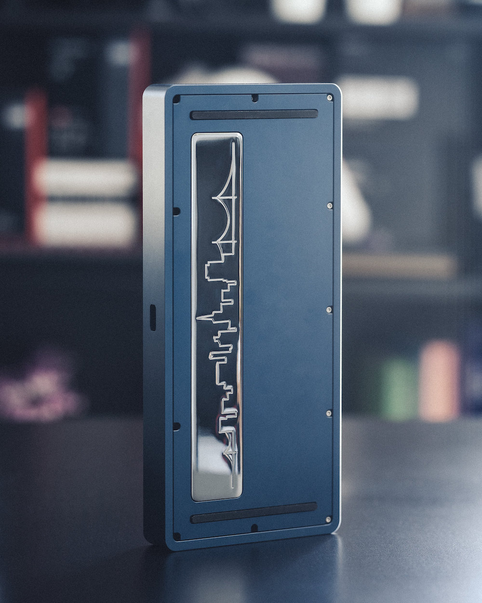
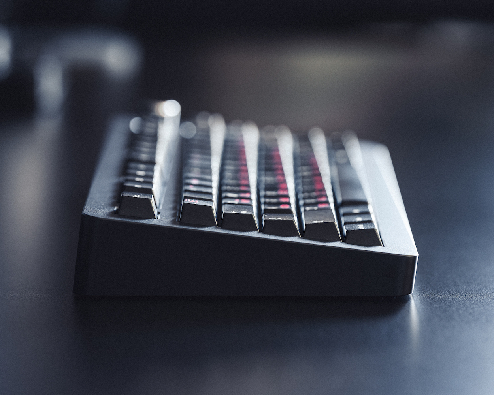
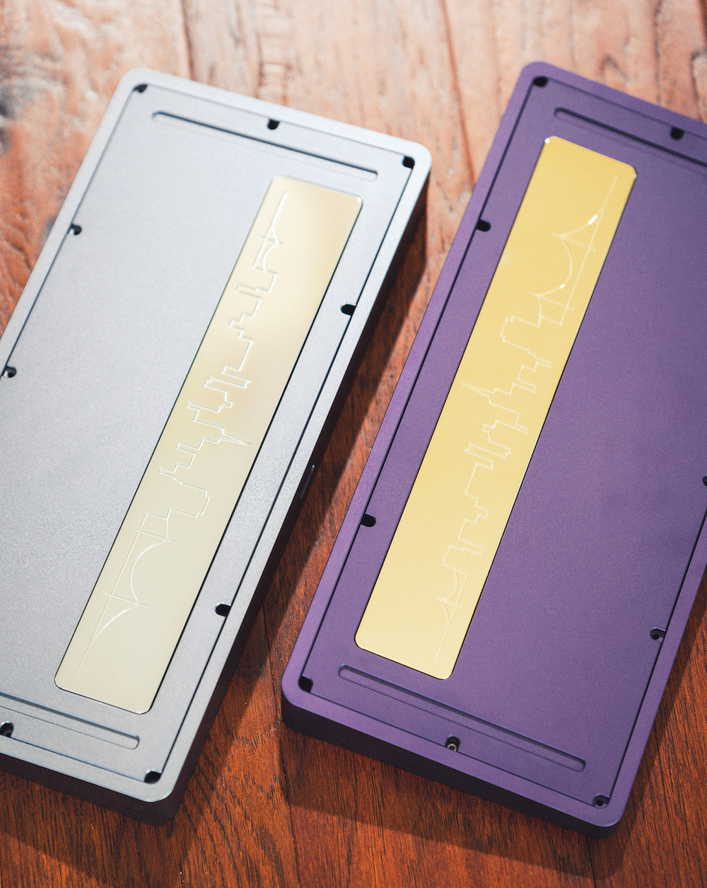
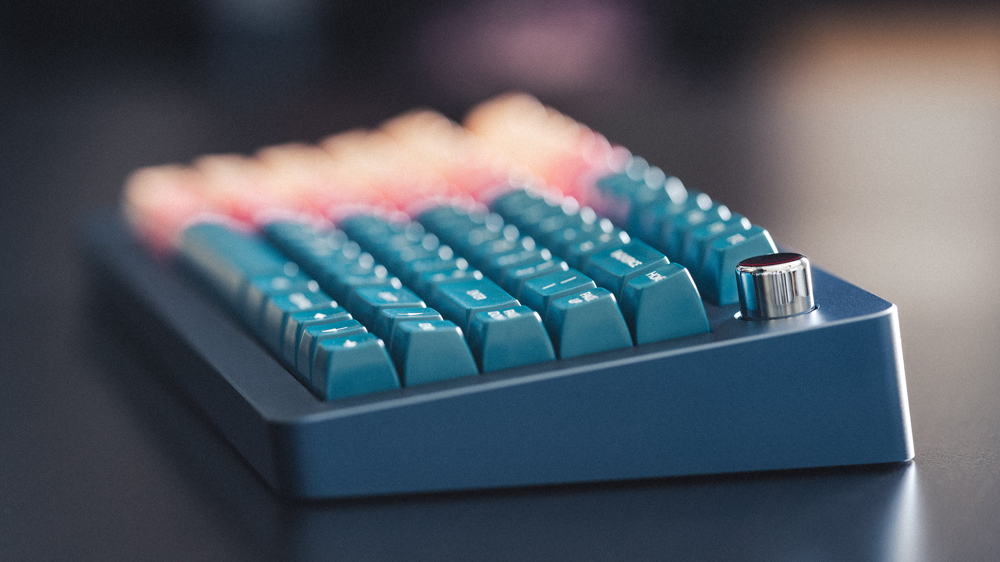
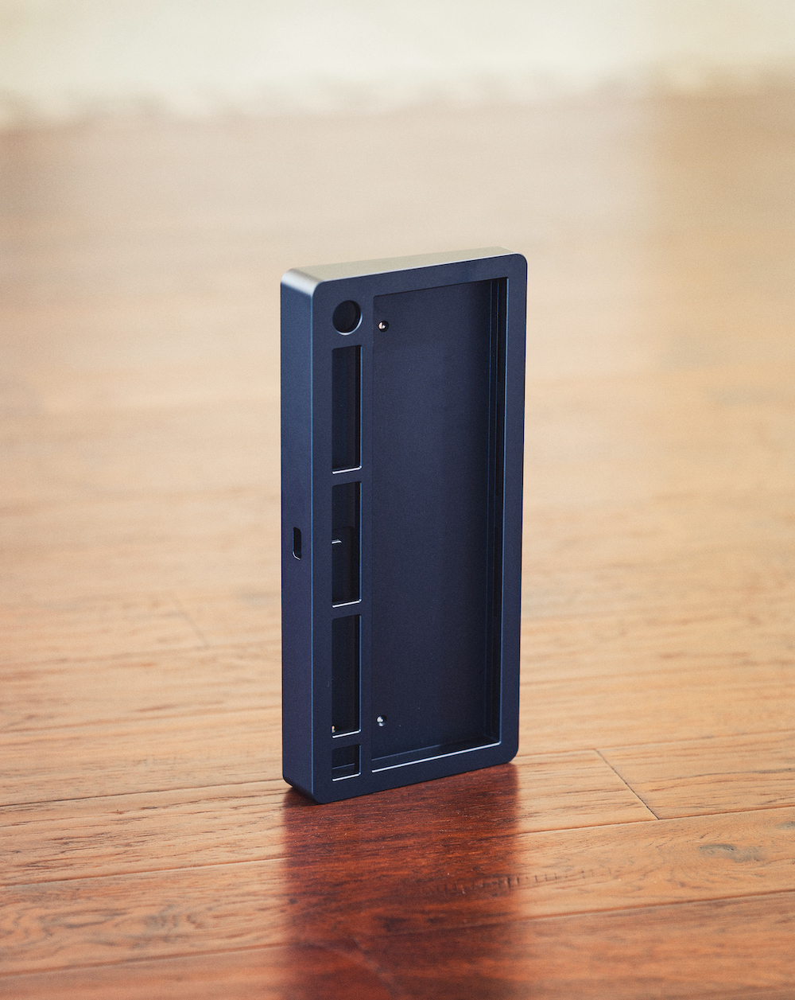
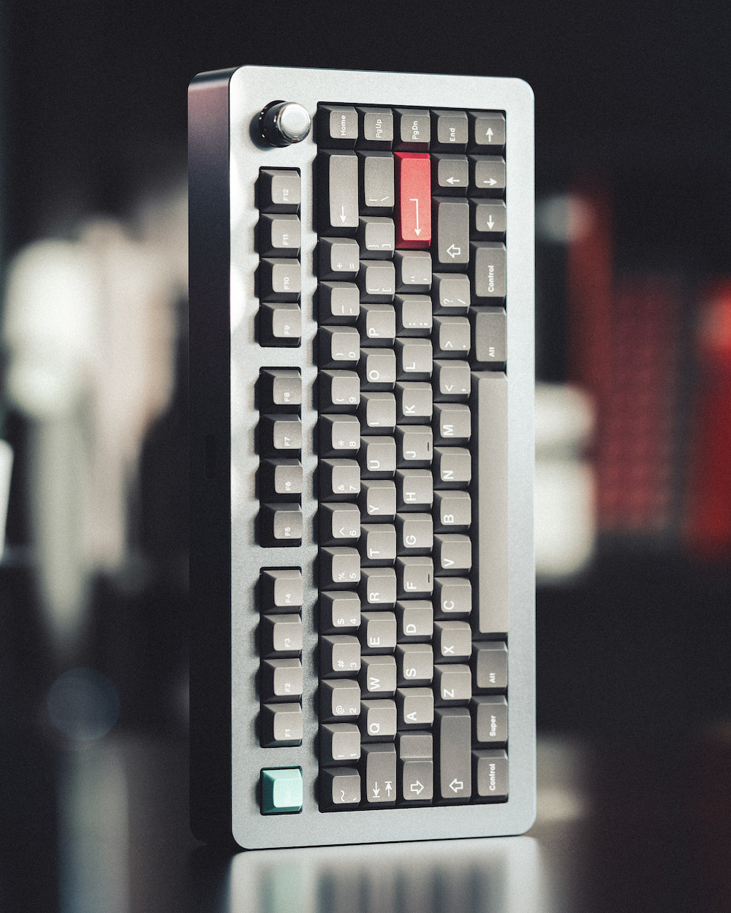
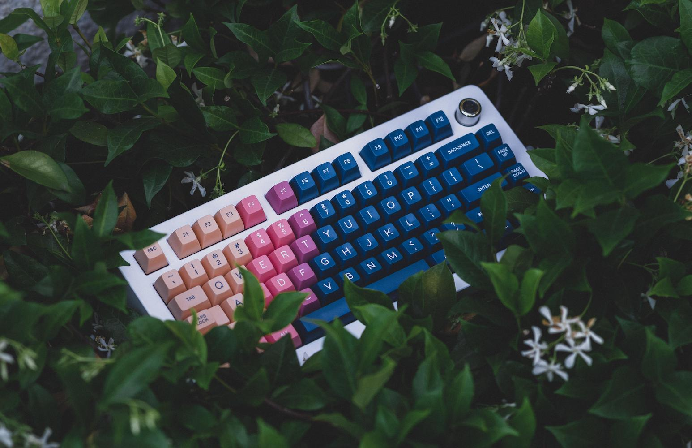

# Overview

### Status: Fulfilled

- **Group Buy Units:** Delivered
- **Extra Units:** Available for Purchase

---

### Design

The **Paragon** is a 75% gasket-mounted keyboard featuring a rotary encoder. Our intent was to design a seamless, substantial, and symmetrical 75% with a rotary encoder. The weight pays homage to our roots with the San Francisco skyline.

### Specifications
- **Layout:** 75%
- **Mounting Style:** Poron and Silicone Gasket Mount
- **Typing Angle:** 7 Degrees
- **Front Height:** 18.6 mm without feet
- **Case Material:** Aluminum
- **Colors:** E-White, Black, Deep Navy, Gunmetal, Purple
- **Plate Options:** 1.5 mm Aluminum, 1.5 mm Polycarbonate
- **PCB Options:** 1.6 mm Hotswap, 1.6 mm Solder
- **Weight and Knob Options:** Brass with a Gold or Silver PVD Finish

### PCB Options and Layouts
- **Hotswap**
  - Normal and Stepped Caps Lock
  - Full and Split Backspace
  - Bottom Row: 1.25u 1.25u 1.25u 6.25u 1.5u 1.5u
  - Bottom Row: 1.5u 1.5u 7u 1.5u 1.5u
- **Solder**
  - Normal and Stepped Caps Lock
  - Full and Split Backspace
  - Split Spacebar Bottom Row: 1.25u 1.25u 1.25u 2.25u 1.25u 2.75u 1.5u 1.5u
  - Bottom Row: 1.25u 1.25u 1.25u 6.25u 1.5u 1.5u

### Groupbuy Information
- **Sale Period:** January 7th, 2022 - January 31st, 2022
- **Vendors:**
  - US: Vala Supply, 300 units
  - Canada: Deskhero, 75 units
  - EU: Candykeys, 75 units
  - Asia: iLumkb, 75 units
  - Oceania: DailyClack, 50 units
- **Sale Format:** First Come First Served

### Configurations and Pricing
- **Base Kit** ($480) includes and allows you to select from the following:
  - **Colors:** 
    - E-White
    - Black
    - Deep Navy
    - Gunmetal
    - Purple
  - **Plate Options:** 
    - Aluminum
    - Polycarbonate
  - **PCB Options:** 
    - Hotswap
    - Solder
  - **Weight and Knob Options:** 
    - Brass with a Gold PVD finish
    - Brass with a Silver PVD finish
    - Note: The weight and knob will match in the base configuration
  - Plate and Case Foam
  - Poron Gaskets
  - Silicone Feet
  - Necessary Hardware
- **Extras** (sold separately):
  - Hotswap PCB: $45
  - Solder PCB: $39
  - Daughterboard: $9
  - Foam Set (gaskets not included): $15
  - Screw Set (all screws for assembly): $5
  - Poron Gasket Set: $9
  - Silicone Gasket Set: $9
  - Silicone Feet: $5
  - Polycarbonate Plate: $29
  - Aluminum Plate: $39
  - Brass Knob Gold PVD: $40
  - Brass Knob Silver PVD: $40
  - Brass Weight Gold PVD: $110
  - Brass Weight Silver PVD: $110
- **KeyLabs Artisan Knobs** (Electroplated Aluminum):
  - Nickel with Purple Resin: $59
  - Nickel with Grey Resin: $59
  - Gunmetal with Blue Resin: $55
  - Gunmetal with Grey Resin: $55
  - Copper with Blue Resin: $55
  - Copper with Grey Resin: $55
- Note: All pricing is in USD, regional pricing may vary

### Build Streams

<iframe width="560" height="315" src="https://www.youtube.com/embed/FSfLUEPeRv8?si=GZUDarqv9ebOq74e" title="YouTube video player" frameborder="0" allow="accelerometer; autoplay; clipboard-write; encrypted-media; gyroscope; picture-in-picture; web-share" allowfullscreen></iframe>

<iframe width="560" height="315" src="https://www.youtube.com/embed/7KdJ7MEapsE" title="YouTube video player" frameborder="0" allow="accelerometer; autoplay; clipboard-write; encrypted-media; gyroscope; picture-in-picture; web-share" allowfullscreen></iframe>

### Sound Tests
<iframe width="560" height="315" src="https://www.youtube.com/embed/YG3L6zfw21k" title="YouTube video player" frameborder="0" allow="accelerometer; autoplay; clipboard-write; encrypted-media; gyroscope; picture-in-picture; web-share" allowfullscreen></iframe>

<iframe width="560" height="315" src="https://www.youtube.com/embed/NtbmRyMDkRQ" title="YouTube video player" frameborder="0" allow="accelerometer; autoplay; clipboard-write; encrypted-media; gyroscope; picture-in-picture; web-share" allowfullscreen></iframe>

<iframe width="560" height="315" src="https://www.youtube.com/embed/t8IRW6TfL9o" title="YouTube video player" frameborder="0" allow="accelerometer; autoplay; clipboard-write; encrypted-media; gyroscope; picture-in-picture; web-share" allowfullscreen></iframe>

<iframe width="560" height="315" src="https://www.youtube.com/embed/1e53OlAWhAs" title="YouTube video player" frameborder="0" allow="accelerometer; autoplay; clipboard-write; encrypted-media; gyroscope; picture-in-picture; web-share" allowfullscreen></iframe>

### External links

- Read more about the original interest check [here](https://geekhack.org/index.php?topic=107743.0)
- Read more about the groupbuy post [here](https://geekhack.org/index.php?topic=115873.0)

