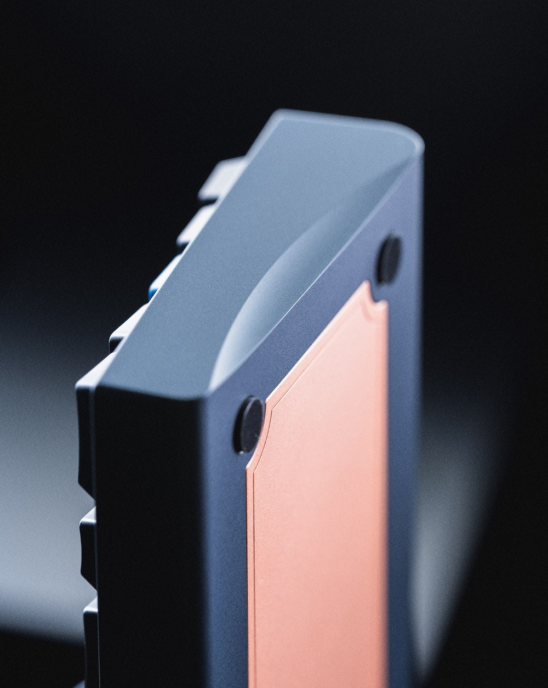

# Overview

### Status: Shipping to Vendors
- Please check our [updates](/blog) page for the latest news regarding the January.
- The keyboard is slated to ship to customers in Q2 2024.

---

### Design

The **January** is a 60% o-ring mounted keyboard featuring accentuated curves and a copper weight. We originally designed the board to test some aesthetic choices, most notably the gentle side sweep with a rounded front and back. The weight engraving was done by kitkat.

### Specifications
- **Layout:** 60%
- **Mounting Style:** Gummy O-Ring 
- **Typing Angle:** 6 Degrees
- **Front Height:** 20.25 mm without feet
- **Case Materials:** Aluminum, Polycarbonate
- **Anodized Aluminum Colors:** Crimson, Steel Blue, Silver
- **Polycarbonate Finishes:** Frosted, Smoked
- **Plate Options:** 1.5 mm Aluminum, 1.5 mm Polycarbonate, 1.5 mm Carbon Fiber, 1.5 mm FR4
- **PCB Options:** 1.6 mm Hotswap, 1.6 mm Solder, compatible with the H60 PCB
- **Weight:** Sandblasted Copper with Clear Coat

### PCB Options and Layouts
- **Hotswap**
  - Normal and Stepped Caps Lock
  - Split Backspace
  - Split Right Shift
  - Bottom Row: 1.5u 1u 1.5u 7u 1.5u 1u 1.5u
- **Solder**
  - Normal and Stepped Caps Lock
  - Full and Split Backspace
  - Full and Split Right Shift
  - Bottom Row: 1.25u 1.25u 1.25u 6.25u 1.25u 1.25u 1.25u 1.25u
  - Bottom Row: 1.5u 1u 1.5u 7u 1.5u 1u 1.5u
  - Note: Solder PCBs support the ISO Layout but the Plate does not

### Groupbuy Information
- **Sale Period:** November 7th, 2022 - December 20th, 2022
- **Vendors:**
  - US: KeebsForAll
  - Canada: Deskhero
  - EU: Candykeys
  - Asia: ZionStudios
  - Oceania: SwitchKeys
- **Sale Format:** First Come First Served with an Undisclosed Soft Cap

### Configurations and Pricing
- **Base Kit** ($295 for smoked polycarbonate and $270 for all other materials, colors, and finishes) includes and allows you to select from the following:
  - **Materials, Colors, and Finishes:**
    - Crimson Anodized Aluminum
    - Steel Blue Anodized Aluminum
    - Silver Anodized Aluminum
    - Frosted Polycarbonate
    - Smoked Polycarbonate
  - **Copper Weight**
  - **Aluminum Plate**
  - 50A Durometer O-Ring
  - Feet
  - Necessary Hardware
- **Extras** (sold separately):
  - **Plates:**
    - Aluminum Plate: $28
    - Polycarbonate Plate: $28
    - FR4 Plate: $28
    - Carbon Fiber Plate: $32
  - **PCBs:**
    - Solder PCB: $40
    - Hotswap PCB: $45
  - **Wrist Rests:**
    - Frosted Polycarbonate with Copper Weight: $160
    - Smoked Polycarbonate with Copper Weight: $175
- Note: All pricing is in USD, regional pricing may vary

Above photo courtesy of Nick the Lard

### Build Stream and Showcase
<iframe width="560" height="315" src="https://www.youtube.com/embed/-jxQMKH6k0c" title="YouTube video player" frameborder="0" allow="accelerometer; autoplay; clipboard-write; encrypted-media; gyroscope; picture-in-picture; web-share" allowfullscreen></iframe>

<iframe width="560" height="315" src="https://www.youtube.com/embed/ELexhC8gr8U" title="YouTube video player" frameborder="0" allow="accelerometer; autoplay; clipboard-write; encrypted-media; gyroscope; picture-in-picture; web-share" allowfullscreen></iframe>

### Sound Tests

<iframe width="560" height="315" src="https://www.youtube.com/embed/Yd4wMTb88vs" title="YouTube video player" frameborder="0" allow="accelerometer; autoplay; clipboard-write; encrypted-media; gyroscope; picture-in-picture; web-share" allowfullscreen></iframe>

<iframe width="560" height="315" src="https://www.youtube.com/embed/tooRnWomplY" title="YouTube video player" frameborder="0" allow="accelerometer; autoplay; clipboard-write; encrypted-media; gyroscope; picture-in-picture; web-share" allowfullscreen></iframe>

### Earlier Prototypes

<iframe width="560" height="315" src="https://www.youtube.com/embed/XW8tdI4lXrk" title="YouTube video player" frameborder="0" allow="accelerometer; autoplay; clipboard-write; encrypted-media; gyroscope; picture-in-picture; web-share" allowfullscreen></iframe>

<iframe width="560" height="315" src="https://www.youtube.com/embed/EHD1e50rN3Q" title="YouTube video player" frameborder="0" allow="accelerometer; autoplay; clipboard-write; encrypted-media; gyroscope; picture-in-picture; web-share" allowfullscreen></iframe>

### External links

- Read more about the original interest check [here](https://geekhack.org/index.php?topic=116498.0)
- Read more about the groupbuy post [here](https://geekhack.org/index.php?topic=118764.0)