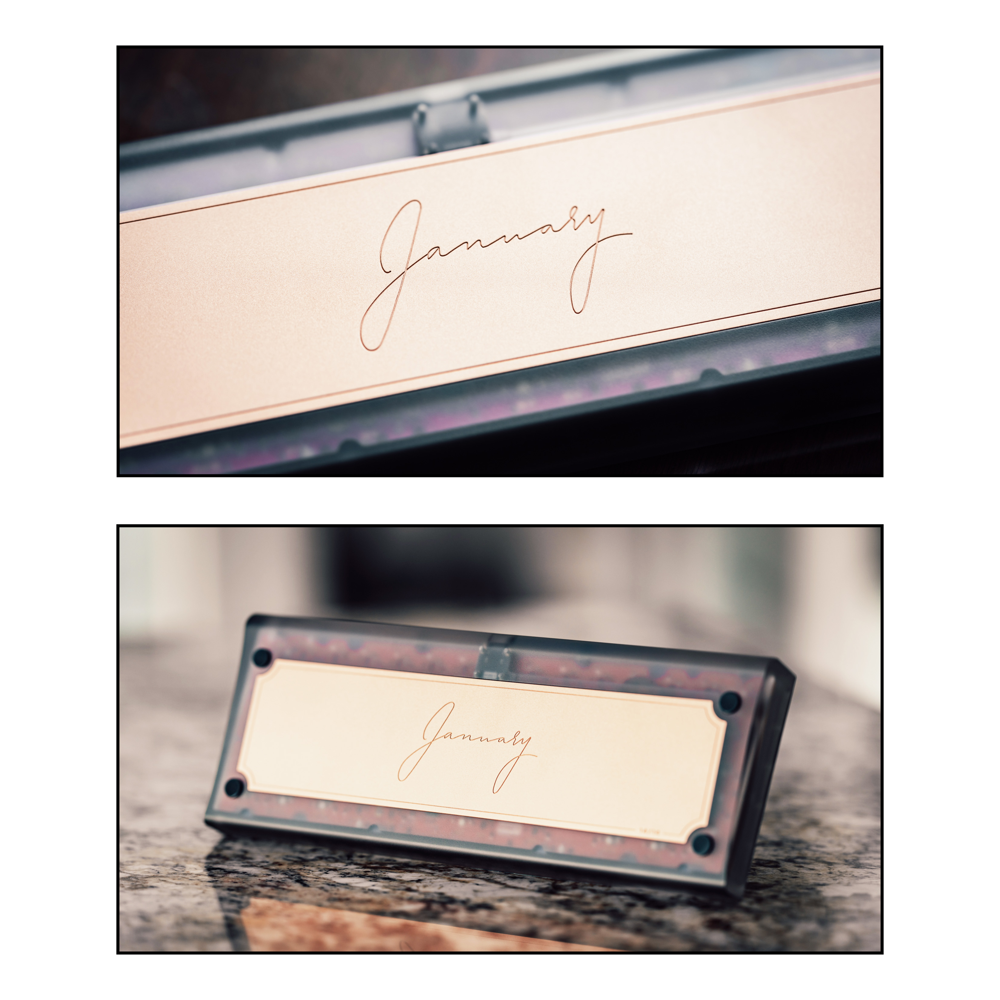

# Overview

### Status: In Progress
- Manufacturing of the January is currently in progress. Please check our [Updates](/blog) page for progress on the January.
- The keyboard is slated to ship to customers in Q4 2023.

---

## Description

The **January** is a 60% O-Ring mount keyboard featuring a copper weight and a sweeping side profile. The design of the
January came about as an experiment to test the accentuated side curves and rounded front and back edges, and it eventually
forked into its own project.

The January features a scripted engraving of its name on the copper weight, framed within an outline. The design on the weight was
done by kitkat.

## Details

- **Layout:** 60%
- **Mounting Style:** O-Ring 
- **Typing Angle:** 6 degrees
- **Offered Aluminum Colors:**
  - Crimson
  - Steel Blue
  - Silver
- **Offered Polycarbonate Finishes:**
  - Smoked
  - Frosted
- **Offered PCB Options:**
    - Hotswap
    - Solder
- **Offered Plate Options:**
    - 1.5mm Aluminum
    - 1.5mm Polycarbonate
    - 1.5mm Carbon Fiber
    - 1.5mm FR4
- **Groupbuy Period:** November 7th - December 20th
- **Pricing:** 
  - Aluminum/Frosted PC: $270
  - Smoked PC: $295

More information can be found in the following GeekHack pages:

Interest Check: https://geekhack.org/index.php?topic=116498.0

Groupbuy: https://geekhack.org/index.php?topic=118764.0

