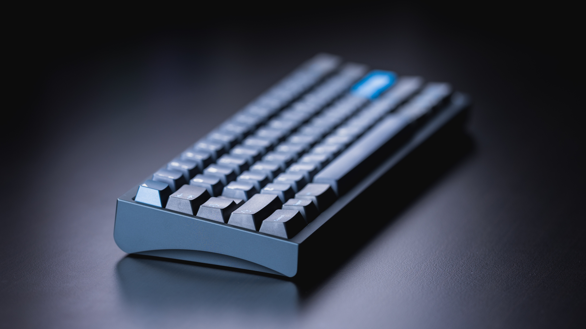
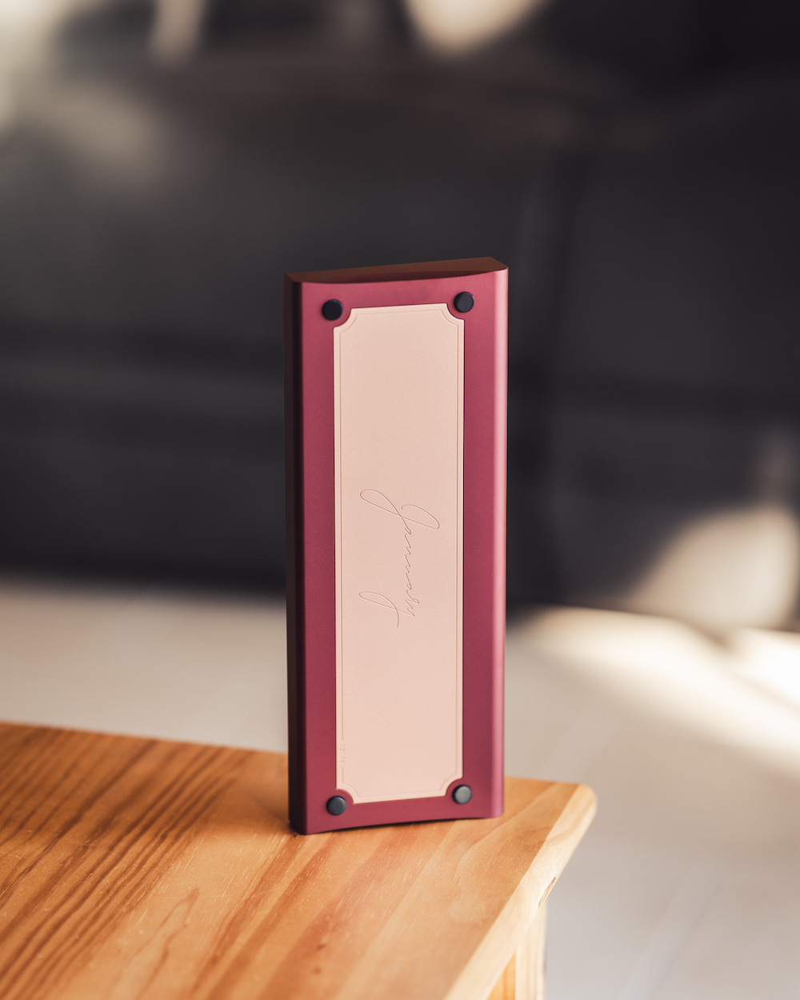
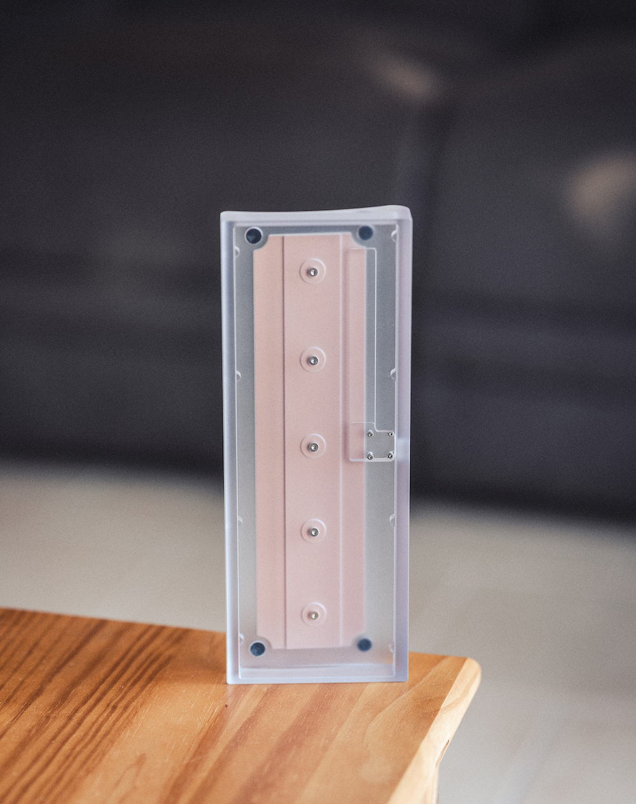
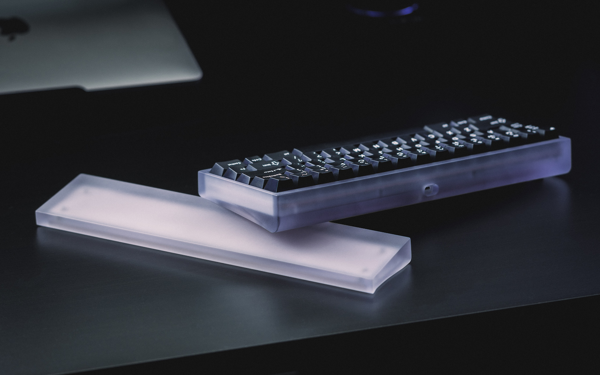
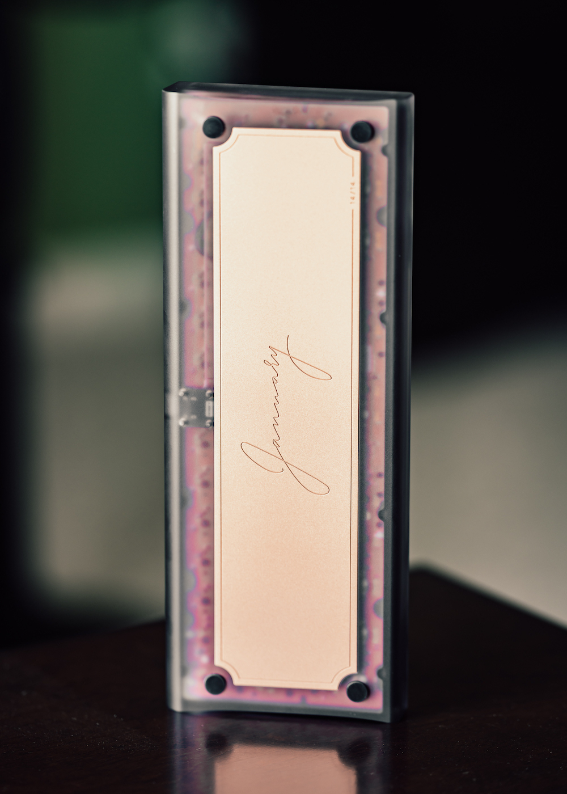
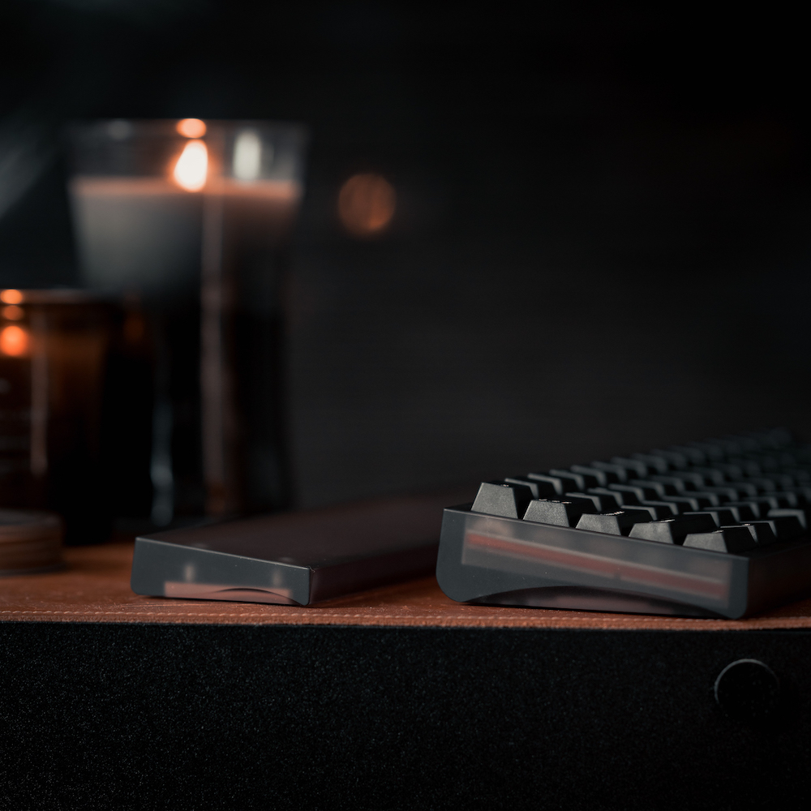

# Overview

### Status: In Production
- Manufacturing is currently underway. Please check our [updates](/blog) page for the latest news regarding the January.
- The keyboard is slated to ship to customers in Q4 2023.

---

### Description

The **January** is a 60% o-ring mounted keyboard featuring accentuated curves and a copper weight. We originally designed the board to test some aesthetic choices, most notably the gentle side sweep with a rounded front and back. The weight engraving was done by kitkat.

### Details

- **Layout:** 60%
- **Mounting Style:** O-Ring 
- **Typing Angle:** 6 degrees
- **Offered Aluminum Colors:**
  - Crimson
  - Steel Blue
  - Silver
- **Offered Polycarbonate Finishes:**
  - Smoked
  - Frosted
- **Offered PCB Options:**
    - Hotswap
    - Solder
- **Offered Plate Options:**
    - 1.5mm Aluminum
    - 1.5mm Polycarbonate
    - 1.5mm Carbon Fiber
    - 1.5mm FR4
- **Groupbuy Period:** November 7th - December 20th
- **Pricing:** 
  - Aluminum/Frosted PC: $270
  - Smoked PC: $295

Above photo courtesy of Nick the Lard

### Build Stream and Showcase
<iframe width="560" height="315" src="https://www.youtube.com/embed/-jxQMKH6k0c" title="YouTube video player" frameborder="0" allow="accelerometer; autoplay; clipboard-write; encrypted-media; gyroscope; picture-in-picture; web-share" allowfullscreen></iframe>

<iframe width="560" height="315" src="https://www.youtube.com/embed/ELexhC8gr8U" title="YouTube video player" frameborder="0" allow="accelerometer; autoplay; clipboard-write; encrypted-media; gyroscope; picture-in-picture; web-share" allowfullscreen></iframe>

### Sound Tests

<iframe width="560" height="315" src="https://www.youtube.com/embed/Yd4wMTb88vs" title="YouTube video player" frameborder="0" allow="accelerometer; autoplay; clipboard-write; encrypted-media; gyroscope; picture-in-picture; web-share" allowfullscreen></iframe>

<iframe width="560" height="315" src="https://www.youtube.com/embed/tooRnWomplY" title="YouTube video player" frameborder="0" allow="accelerometer; autoplay; clipboard-write; encrypted-media; gyroscope; picture-in-picture; web-share" allowfullscreen></iframe>

### Earlier Prototypes

<iframe width="560" height="315" src="https://www.youtube.com/embed/XW8tdI4lXrk" title="YouTube video player" frameborder="0" allow="accelerometer; autoplay; clipboard-write; encrypted-media; gyroscope; picture-in-picture; web-share" allowfullscreen></iframe>

<iframe width="560" height="315" src="https://www.youtube.com/embed/EHD1e50rN3Q" title="YouTube video player" frameborder="0" allow="accelerometer; autoplay; clipboard-write; encrypted-media; gyroscope; picture-in-picture; web-share" allowfullscreen></iframe>

### External links

- Read more about the original interest check [here](https://geekhack.org/index.php?topic=116498.0)
- Read more about the groupbuy post [here](https://geekhack.org/index.php?topic=118764.0)