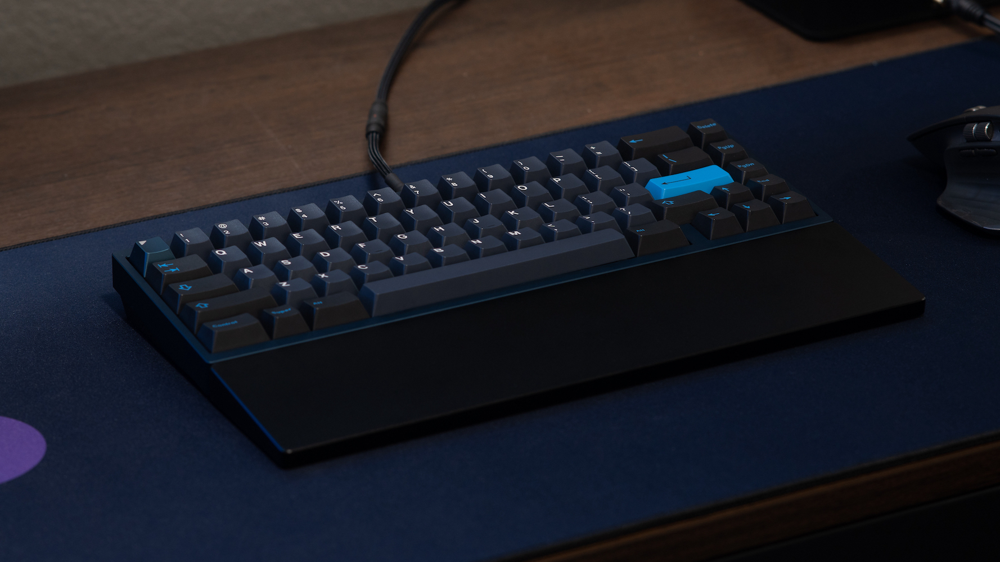
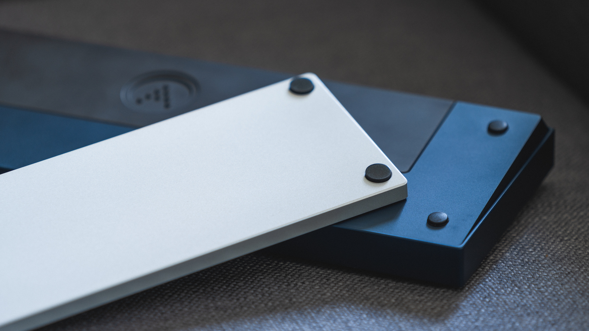
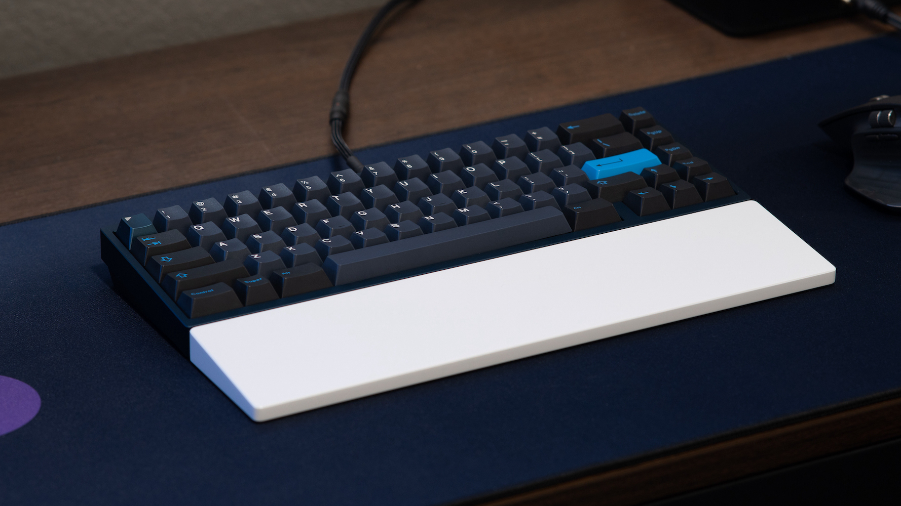
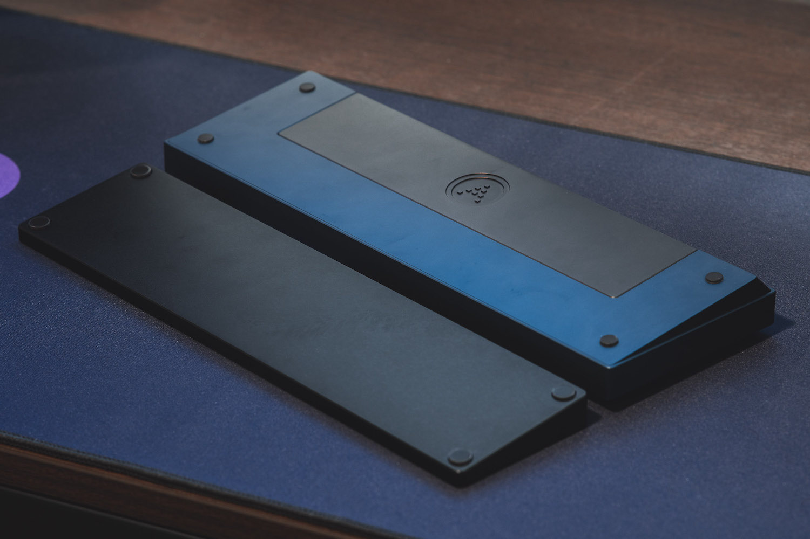

# Overview

### Status: Delivered

---

### Design

The **Vega Wrist Rest** is a solid aluminum wrist rest designed to match the profile of ai03's Vega.

### Specifications
- **Material:** Aluminum
- **Angle:** 6.5 degrees
- **Width:** 315 mm
- **Depth:** 80 mm

### Groupbuy Information
- **Round 1 Groupbuy Period:** October 18th, 2021 - November 15th, 2021
  - **Vendor:** KeebsForAll
  - **Offered Aluminum Colors:**
    - E-White
    - Black
  - **Price:** $100
- **Round 2 Groupbuy Period:** June 27th, 2022 - July 25th, 2022
  - **Vendor:** KeebsForAll
  - **Offered Aluminum Colors:**
    - E-White
    - Black
    - Silver (Raw Aluminum with a Clear Coat)
  - **Price:** $90

### External links

- Read more about the original interest check [here](https://geekhack.org/index.php?topic=113278.0)